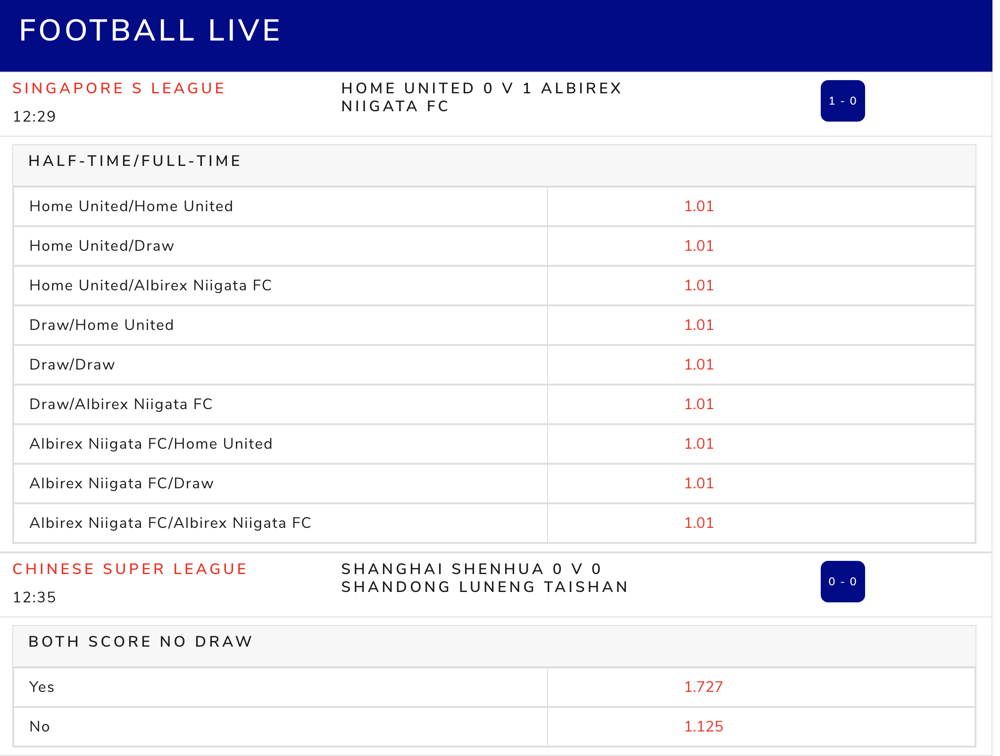

# SKY BETTING AND GAMING TECT TEST

[](https://github.com/kiruba48/SKY_TECHTEST/actions/workflows/test.yml)

## Getting Started

This project is for the purpose of showcasing my technical skill for an interview at Sky Betting and Gaming.

## System Requirements

Docker

## Running the API and Websocket Server

### `docker-compose up`

```
docker-compose up
```

## Available Scripts

In the project directory, you can run:

### `npm start`

```
npm start
```

Runs the app in the development mode.\
Open [http://localhost:3000](http://localhost:3000) to view it in the browser.

---

## Technology Choices

- `React` - chosen React considering the complex nature of tasks, dealing with websocket data. React also provides various advantages such as easy maintenance and scalability of codebase with its ability to reuse system components. It make updates, version management and further installation of components easy. It ensures high performance and faster rendering (virtual DOM).

- `TypeScript` - TypeScript gives the code more structure, making it self documenting and more readable that helps in speeding up debugging and refactoring. It's strong `Static` typing allows catching bugs earlier results in less error-prone code and better performance. `TypeScript` is one of my favorite tool in used in this application.

- `Redux` - Redux is my choice of State management Library. It makes maintenance and Debugging easy. I have used React `Context` in this application as well. I used context to manage the local state such as Odds view functionality and `Redux` for data that deals with `Websocket`.

- `React-Bootstrap` - I operated in an assumption that the tasks provided are heavily focused on using data from `Websocket` server and its management. So I decided to use React-Bootstrap instead of building the UI component from scratch to concentrate more on working with data.

---

## App Demo

### Main Events Page

Page Displays the currently live football events.


### Market Outcome Decimal View

Primary market for the live football events and their odds in decimal view in appropriate layout.



### Market Outcome Fraction View

Primary market for the live football events and their odds in fractional view in appropriate layout.


### Event Information page

Full details page about the live football event with all of it markets and event information.


### My Bet Slip

Bet Slip displays the chosen outcome that the user desires to bet.


### Odds Toggle

Functionality to toggle the Odds display that can be applied globally in the application.


